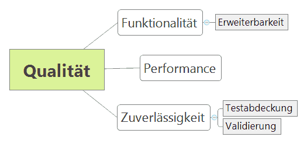

[[section-quality-scenarios]]
== Qualitätsanforderungen

=== Qualitätsbaum

=== Qualitätsszenarien

[cols="1,1,4" options="header"]
|===
|Merkmal |Untermerkmal |Szenario

|Funktionalität
|Erweiterbarkeit
|Falls die vorhanden Funktionalität nicht ausreicht, sollten Fachwerte erweitert werden können.

|Performance
|
|Performance spielt eine untergeordnete Rolle beim Anlegen von Objekten.
Wichtiger ist, dass nur valide Objekte erzeugt werden können.

|Zuverlässigkeit
|Testabdeckung
|Es wird eine Testabdeckung von über 70% angestrebt
(aktuell: https://coveralls.io/github/oboehm/jfachwert?branch=master[image:https://coveralls.io/repos/github/oboehm/jfachwert/badge.svg?branch=master[Coverage Status]])

|
|Validierung
|Es sollen nur gültige Objekte angelegt werden können.
Ungültige Objekte sollen mit einer ValidationException zurückgewiesen werden.
|===
